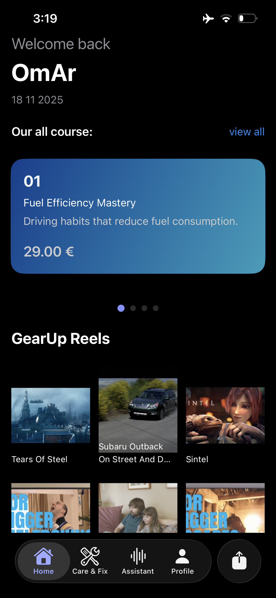
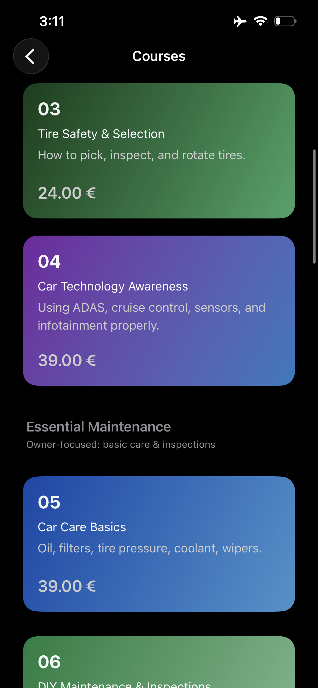
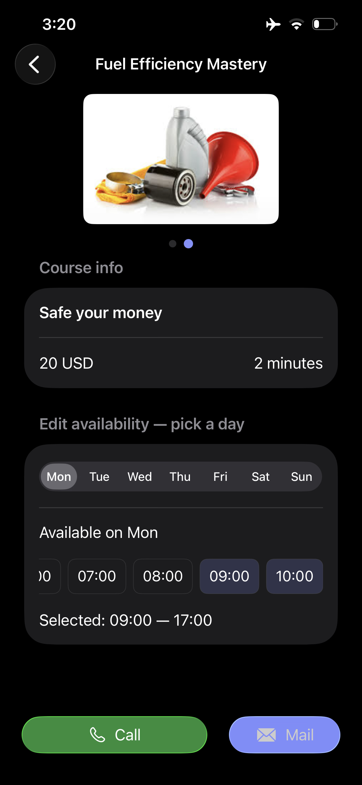
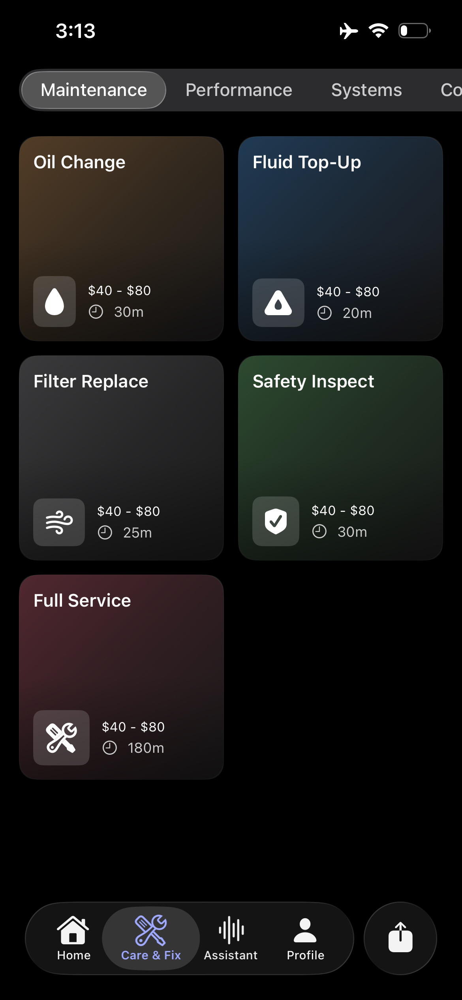
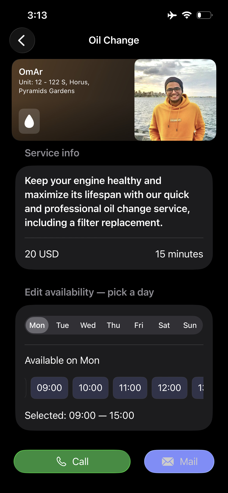
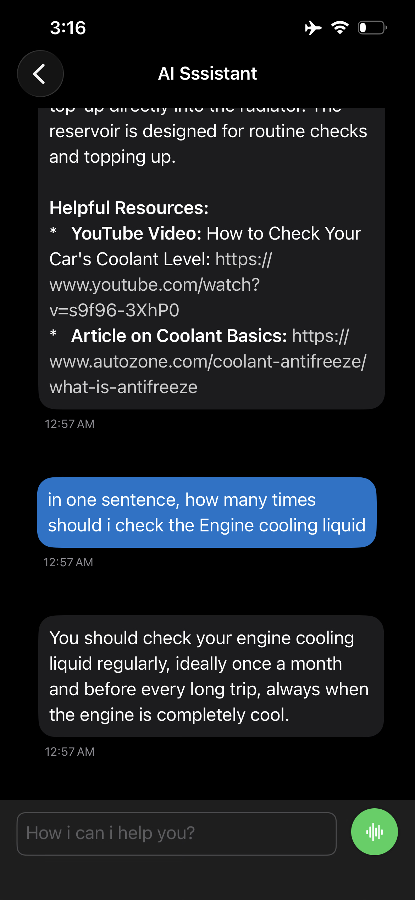
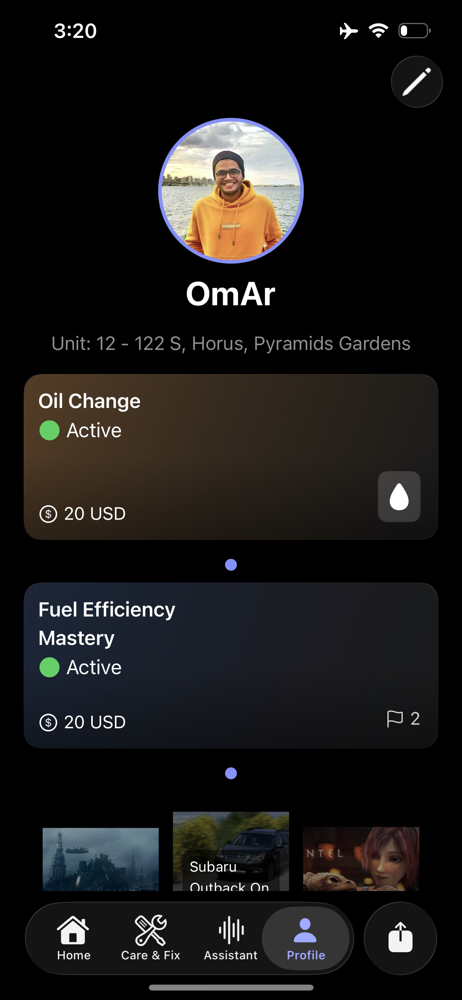

# DriveLine — iOS (SwiftUI) + NestJS/Fastify + React Vite Admin

<p align="center">


</p>

**DriveLine** is a full-stack, enterprise-grade platform combining an iOS SwiftUI mobile app, a distributed NestJS/Fastify backend with advanced flow control and microservices orchestration, and a React/Vite admin dashboard for system management. Built with TypeScript, leveraging MongoDB + PostgreSQL for polyglot persistence, Valkey for distributed caching, RabbitMQ for asynchronous job processing, and integrated Gemini AI voice assistance.

A sophisticated backend and admin infrastructure powering:

* **Driving Schools Management** — Instructor matching, lesson scheduling, progress analytics
* **AI-Powered Voice Assistant** — Gemini integration with context-aware NLP
* **Vehicle Maintenance Orchestration** — Predictive analytics, parts catalog, service tracking with EventKit sync
* **Real-time Admin Dashboard** — React Vite SPA with centralized state management and type-safe API integration
* **Distributed System Architecture** — Flow control, circuit breakers, priority queuing, IP reputation scoring, webhook isolation

This repository provides a production-hardened, horizontally-scalable backend built with **Node.js**, **NestJS**, **Fastify**, **TypeScript**, **Mongoose**, **PostgreSQL**, **Valkey**, **RabbitMQ**, and **Socket.IO**, paired with a modern admin dashboard using **React 19**, **TypeScript**, **Zustand**, and **Vite**.

### Final App Version
- **Distributed Backend Architecture** — NGINX sidecar routing, webhook isolation, multi-process model (API, Worker, Webhook Handler)
- **Advanced Flow Control** — Sliding window rate limiting, circuit breakers, priority queuing with backpressure, IP reputation scoring
- **Caching Strategy** — Valkey-backed distributed cache with dual-window enforcement and cache-coherence patterns
- **Message Queue Orchestration** — RabbitMQ AMQP with DLX, exponential backoff retry logic, poison message handling
- **Polyglot Persistence** — MongoDB (document store), PostgreSQL (ACID financial records), Valkey (real-time flow state)
- **Real-time Communication** — Socket.IO with namespaces for bi-directional chat, typing indicators, read receipts
- **Payment Processing** — Stripe integration with idempotency keys, event sourcing, saga pattern for multi-step captures
- **Security Hardening** — Zero-trust network model, cryptographic HS256/Argon2id, dropped Linux capabilities, read-only FS
- **Admin Dashboard** — React Vite SPA with Zustand stores, lazy-loaded routes, centralized API client, type-safe DTOs
- **Observability** — Structured logging, health checks, circuit breaker metrics, PostgreSQL audit trails

-------------

## Screenshot

<table>
    <tr>
      <td>  </td>
      <td>  </td>
    </tr>
    <tr>
      <td>  </td>
      <td>  </td>
    </tr>
    <tr>
      <td>  </td>
      <td>  </td>
    </tr>
    <tr>
      <td>  </td>
      <td>  </td>
    </tr>
</table>

-------------

## Screen Records

### iOS App
https://github.com/user-attachments/assets/cd190008-f791-41e2-8544-eecadba35408

### Admin Panel
https://github.com/user-attachments/assets/c3ee2d7b-73b9-45ea-8e75-9301c8bcc369

-------------

## 🌟 Core Features

### 🎓 Intelligent Driving School Management
- **Interactive Learning Modules**: Comprehensive driving theory with progress tracking
- **Instructor Matching**: AI-powered instructor pairing based on learning style and availability
- **Lesson Scheduling**: Real-time availability and booking system with conflict resolution
- **Progress Analytics**: Detailed performance metrics and skill development tracking
- **Road Test Preparation**: Mock tests and examination route familiarization

### 🔧 Advanced Vehicle Maintenance System
- **Maintenance Tracking**: Automated service interval monitoring and reminders
- **Digital Vehicle Health Records**: Complete maintenance history with service documentation
- **Predictive Maintenance**: AI-driven alerts for potential issues before they occur
- **Parts & Service Catalog**: Integrated database of maintenance procedures and replacement parts
- **Cost Tracking**: Service expense monitoring and budget planning

### 🗣️ AI Voice Assistant (Gemini Integration)
- **Natural Language Processing**: Voice-activated commands for hands-free operation
- **Context-Aware Assistance**: Intelligent responses based on current app context and user history
- **Maintenance Guidance**: Step-by-step voice instructions for common vehicle repairs
- **Learning Support**: Interactive Q&A for driving theory and practical skills
- **Smart Scheduling**: Voice-controlled calendar management for lessons and maintenance

### 📅 Intelligent Scheduling with EventKit
- **Seamless Calendar Integration**: Automatic synchronization with native iOS Calendar app
- **Conflict Resolution**: Smart scheduling that avoids timing conflicts across driving lessons and maintenance
- **Location-Based Reminders**: Geo-fenced notifications for appointments and maintenance due dates
- **Recurring Event Management**: Automated scheduling for regular maintenance and recurring lessons
- **Multi-Calendar Support**: Integration with personal, work, and custom vehicle calendars


## 🛠️ Tech Stack

### Client (iOS)

| Layer               | Technology                           |
| ------------------- | ------------------------------------ |
| Language            | Swift                                |
| UI Framework        | SwiftUI                              |
| Reactive Programming| Combine / async-await                |
| Calendar & Scheduling| EventKit                            |
| Voice I/O           | AVFoundation / Speech                |

### Backend (Server)

| Layer               | Technology                           |
| ------------------- | ------------------------------------ |
| Runtime             | Node.js 25+                          |
| Framework           | NestJS 11.1                          |
| HTTP Server         | Fastify 5.x                          |
| Reverse Proxy       | NGINX (sidecar)                      |
| Language            | TypeScript 5.9                       |
| Primary Database    | MongoDB + Mongoose                   |
| Transaction DB      | PostgreSQL (ACID financial)          |
| Cache Layer         | Valkey (Redis-compatible)            |
| Message Queue       | RabbitMQ (AMQP)                      |
| Real-time Events    | Socket.IO                            |
| External API Client | Axios                                |
| Authentication      | JWT (HS256) + Passport               |
| Password Hashing    | Argon2id                             |

### Admin Dashboard (Web)

| Layer               | Technology                           |
| ------------------- | ------------------------------------ |
| Framework           | React 19.2                           |
| Build Tool          | Vite 7.2                             |
| Language            | TypeScript 5.9 (strict mode)         |
| State Management    | Zustand 5.0 + persistence middleware |
| Routing             | React Router DOM 7.9 (lazy loading)  |
| HTTP Client         | Axios 1.13 (interceptors)            |
| Code Quality        | ESLint 9.39 (React hooks + TS)       |
| Dev Server          | Vite dev with API proxy              |


### Architecture: Single Image, Multi-Process Model

The production deployment follows **bulkhead isolation** with four separate processes:

```
┌─ NGINX (PID 1, daemon off)
│  ├─ TLS termination (optional)
│  ├─ HTTP/2 multiplexing
│  ├─ Path-based routing
│  └─ X-Forwarded-For extraction
│
├─ API Process (PID 2, primary)
│  ├─ HTTP/REST handlers
│  ├─ Flow control layer
│  ├─ Request validation & DTOs
│  └─ WebSocket server (Socket.IO)
│
├─ Worker Process (PID 3, async jobs)
│  ├─ RabbitMQ AMQP consumer
│  ├─ Gemini AI job processor
│  ├─ Stripe charge orchestration
│  └─ Exponential backoff retry logic
│
└─ Webhook Handler (PID 4, isolated)
   ├─ Raw body parsing (pre-middleware)
   ├─ HMAC signature verification
   ├─ Idempotency enforcement
   └─ Dead letter handling
```

**Design Rationale**: Webhook handlers run isolated to prevent memory leaks or blocking from affecting API responsiveness. Worker processes handle CPU-intensive AI tasks off the request-response path.

### Flow Control Engineering

**Rate Limiting**: Sliding window counter with dual enforcement (per-minute + per-hour):

```typescript
// Valkey ZADD + ZCOUNT for atomic ops, no Lua scripts needed
const minuteWindow = await checkSlidingWindow(ip, minuteLimit, 'minute');
const hourlyWindow = await checkSlidingWindow(ip, hourlyLimit, 'hour');

// IP reputation multipliers dynamically adjust limits
// Excellent (>90): 2x limit | Good (70-90): 1x | Fair (40-70): 0.5x | Poor (<40): 0.1x + CAPTCHA
```

**Circuit Breaker**: State machine with Valkey persistence for graceful degradation:

```
CLOSED ──(threshold failures)──> OPEN ──(timeout)──> HALF_OPEN ──(probe)──> CLOSED
```

Persisted state survives process restarts; ~100ms of OPEN state acceptable vs persistent memory pressure.

**Priority Queuing**: Three-tier backpressure with weighted round-robin:

- **CRITICAL** (0): Health checks, internal APIs — unbounded, 60s timeout
- **HIGH** (1): Authenticated users — 500 max queue, 30s timeout
- **NORMAL** (2): Public endpoints — 200 max queue, 15s timeout
- **LOW** (3): Batch/analytics — 100 max queue, 5s timeout

**IP Reputation**: Scoring decay prevents attackers from easily clearing history:

```
score = baseScore 
  - (rateLimitViolations × 10)
  - (failedLogins × 5)
  + (accountAge × 5)
  + (successfulTransactions × 2)
```

---

# Quick Start — Admin Dashboard (React + Vite)

Project folder: `driveline-react-vite-dashboard` (adjust path if you fork/clone).

### Install & Run

```bash
# install deps
npm install

# dev server with HMR & API proxy
npm run dev

# type-check TypeScript
npm run build

# preview production build locally
npm run preview

# ESLint validation
npm run lint
```

> Vite dev server proxies `http://localhost:5173/api/*` to backend at `http://localhost:3000`. Hot Module Replacement (HMR) enables instant feedback during development.

### Architecture

**Layered Design** for separation of concerns:

```
┌─────────────────────────────────────────┐
│  Presentation Layer                     │
│  ├─ React components (src/pages/)       │
│  ├─ Shared UI components (src/common/)  │
│  └─ Route guards & lazy loading         │
├─────────────────────────────────────────┤
│  State Management (Zustand)             │
│  ├─ UsersStore, CoursesStore, etc.      │
│  ├─ Async data fetching + error states  │
│  └─ localStorage persistence            │
├─────────────────────────────────────────┤
│  API Layer                              │
│  ├─ Axios client (src/api/client.ts)    │
│  ├─ Request/response interceptors       │
│  ├─ Auth header injection               │
│  └─ Global error handling               │
├─────────────────────────────────────────┤
│  Type Safety (DTOs)                     │
│  ├─ src/dto/*.ts — API contracts        │
│  ├─ Strict TypeScript (noImplicitAny)   │
│  └─ Runtime validation with class-val  │
├─────────────────────────────────────────┤
│  Routing Layer (React Router)           │
│  ├─ Route constants (src/routes/)       │
│  ├─ Code splitting via React.lazy()     │
│  ├─ Protected routes with auth guards   │
│  └─ Navigation persistence              │
└─────────────────────────────────────────┘
```

### State Management Patterns

**Zustand Stores** with async data fetching:

```typescript
interface UserStore {
  users: User[];
  loading: boolean;
  error: string | null;
  
  // Async fetchers with force-refresh
  fetchUsers: (search?: string, force?: boolean) => Promise<boolean>;
  
  // Optimistic updates
  updateUser: (id: string, data: Partial<User>) => Promise<void>;
  deleteUser: (id: string) => Promise<void>;
  
  // Persistence via middleware
}

// Automatic localStorage sync via persist middleware
const useUserStore = create<UserStore>()(
  persist((set) => ({ /* store implementation */ }), {
    name: 'user-store',
    version: 1,
  })
);
```

**API Integration** with type-safe endpoints:

```typescript
export const ENDPOINTS = {
  users: {
    getAll: (search: string | undefined, limit: number, skip: number) =>
      `/api/v1/users/all?search=${encodeURIComponent(search)}&limit=${limit}&skip=${skip}`,
    getById: (id: string) => `/api/v1/users/${id}`,
    update: (id: string) => `/api/v1/users/${id}`,
    delete: (id: string) => `/api/v1/users/${id}`,
  },
};
```

### Build Optimization

**Chunk Splitting** for parallelizable downloads:

```typescript
// vite.config.ts
build: {
  rollupOptions: {
    output: {
      manualChunks: {
        'vendor-react': ['react', 'react-dom'],
        'vendor-router': ['react-router-dom'],
        'vendor-zustand': ['zustand'],
        'vendor-axios': ['axios'],
      },
    },
  },
}
```

**Bundle Limits**: Warnings at 700KB chunks encourage tree-shaking and lazy loading.

---

# Advanced Backend Architecture Patterns

## NestJS + Fastify Implementation Checklist

1. **Routing → Controllers**
   - Convert routes to `@Controller()` + `@Get()`, `@Post()` methods
   - Nest DTOs use `class-validator` decorators for validation
   - Path parameters via `@Param()`, query via `@Query()`, body via `@Body()`

2. **Handlers → Services**
   - Business logic in `@Injectable()` services
   - Controllers remain thin: validate, delegate, return response
   - Services handle all data transformations and external calls

3. **Middlewares → Guards / Interceptors / Pipes**
   - Auth middleware → `AuthGuard('jwt')` / custom `@UseGuards(JwtAuthGuard)`
   - Validation middleware → `ValidationPipe` (global in `main.ts`)
   - Logging/response shaping → `@Injectable()` interceptors

4. **Dependency Injection**
   - Replace manual `require()` with Nest DI (`providers` in module metadata)
   - Ensure correct module scope: `forRoot()` once globally, `forFeature()` per module
   - Services automatically singleton by default

5. **Mongoose Integration**
   - Use `@nestjs/mongoose` + `MongooseModule.forRoot(MONGO_URI)`
   - Schema registration: `MongooseModule.forFeature([{ name: User.name, schema: UserSchema }])`
   - Schema names must match class names exactly (avoid case sensitivity issues on Linux/macOS)

6. **PostgreSQL Integration**
   - Use `@nestjs/typeorm` or `@nestjs/sequelize` for ACID transactions
   - Enable connection pooling (min: 10, max: 20 connections)
   - Use parameterized queries to prevent SQL injection

7. **Error Handling**
   - Replace Express `next(err)` with Nest `HttpException`
   - Create custom `AllExceptionsFilter` for centralized error formatting
   - Filter catches all exceptions and returns normalized JSON responses

8. **Global Configuration**
   - Add `ConfigModule.forRoot({ isGlobal: true, envFilePath: '.env' })`
   - Use `registerAs()` for typed config with validation
   - Avoid `.get()` in services; inject via constructor

9. **Validation Pipeline**
   - Install `class-validator` + `class-transformer`
   - Set globally: `app.useGlobalPipes(new ValidationPipe({ whitelist: true, forbidNonWhitelisted: true, transform: true }))`
   - DTO decorators: `@IsString()`, `@IsEmail()`, `@Min()`, etc.

10. **Authentication & JWT**
    - Implement `PassportModule` + `JwtModule.register({ secret, signOptions })`
    - Create custom `JwtAuthGuard` extending `AuthGuard('jwt')`
    - Inject `@Request()` to access `request.user` in handlers

11. **RabbitMQ Client Integration**
    - Register `ClientsModule.register([{ name, transport: Transport.RMQ, options }])`
    - Inject `@Inject(name) client` and use `client.send()` or `emit()`
    - Consumer: `@MessagePattern()` decorators for request handlers

12. **Redis/Valkey Caching**
    - Use `@nestjs/cache-manager` with Valkey store
    - Decorator: `@Cacheable({ key: 'users', ttl: 300 })`
    - Manual: Inject `CACHE_MANAGER` and call `get()`, `set()`, `del()`

13. **Tests**
    - Convert to Nest testing utilities: `@nestjs/testing`
    - Create `TestingModule` with mocked dependencies
    - Use `Test.createTestingModule()` for module setup

14. **Build & Deployment**
    - Build to `dist/` directory (add to `.gitignore`)
    - Run compiled JS with `node dist/main.js` in production
    - For containerization: Use Alpine Linux, drop capabilities, run as non-root

---

## Fastify Adapter Optimization

**Why Fastify over Express?**

| Criterion                 | Express             | Fastify              | Our Choice                   |
| ------------------------- | ------------------- | -------------------- | ---------------------------- |
| Throughput                | 10K req/s           | 25K+ req/s           | ✅ Fastify (3x faster)        |
| Memory Footprint          | Higher              | Minimal              | ✅ Fastify (lean overhead)    |
| JSON Serialization        | Slow (JSON.stringify)| Fast (custom encoder) | ✅ Fastify (10x faster)       |
| HTTP/2 Support           | Requires plugin     | Native               | ✅ Fastify (built-in)         |
| Streaming                 | Complex middleware  | Native support       | ✅ Fastify (elegant API)      |
| NestJS Integration       | Express adapter     | @nestjs/platform-fastify | ✅ First-class support      |

**Implementation**:
```typescript
// main.ts
import { NestFactory } from '@nestjs/core';
import { FastifyAdapter, NestFastifyApplication } from '@nestjs/platform-fastify';
import { AppModule } from './app.module';

async function bootstrap() {
  const app = await NestFactory.create<NestFastifyApplication>(
    AppModule,
    new FastifyAdapter({ trustProxy: true, http2: true }),
  );

  app.useGlobalPipes(new ValidationPipe({ whitelist: true }));
  app.enableCors({ origin: process.env.CORS_ORIGIN?.split(',') });
  
  await app.listen(3000, '0.0.0.0');
}

bootstrap();
```

---

## Polyglot Persistence Architecture

**MongoDB (Document Store)**:
- User profiles, AI sessions, learning content
- Loose schema for evolving AI conversation formats
- Consistency: eventual (writeConcern: majority)

**PostgreSQL (RDBMS)**:
- Financial transactions, payment records, subscriptions
- Strong ACID guarantees for payment integrity
- Foreign key constraints for data consistency

**Valkey (Cache)**:
- Rate limit counters, session state, circuit breaker state
- Sub-millisecond latency for flow control
- TTL-based expiry prevents stale data

**Trade-offs**: Added operational complexity vs ability to optimize each data pattern independently.

---

Use this checklist after migration to confirm parity:

1. **Routing → Controllers**

   * Convert Express routes to `@Controller()` + `@Get()`, `@Post()` methods.
   * Keep route DTOs but switch to Nest-style DTO classes using `class-validator` decorators.

2. **Handlers → Services**

   * Business logic should live in `@Injectable()` services.
   * Controllers remain thin: validate input, call service, return response.

3. **Middlewares → Guards / Interceptors / Pipes**

   * Auth middleware → `AuthGuard` / `ApiKeyGuard` (`@UseGuards(...)`).
   * Validation middleware → `ValidationPipe` (set globally in `main.ts`).
   * Logging or response shaping → interceptors.

4. **Dependency Injection**

   * Replace `require()` / manual injection with Nest DI (`providers` in module metadata).
   * Make sure singleton/shared services are provided at the correct module scope.

5. **Mongoose**

   * Use `@nestjs/mongoose` with `MongooseModule.forRoot(process.env.MONGO_URI)` and `MongooseModule.forFeature([{ name: User.name, schema: UserSchema }])`.
   * Keep schema names consistent; prefer `schemaName` exact casing to avoid import/case issues on macOS/Linux.

6. **Error handling**

   * Replace centralized Express error-handler with Nest `HttpException` and (optionally) a custom `AllExceptionsFilter`.

7. **Global config**

   * Add `ConfigModule.forRoot({ isGlobal: true, envFilePath: '.env' })` and typed config with `registerAs()` if desired.

8. **Validation**

   * Use `class-validator` + `class-transformer` with `app.useGlobalPipes(new ValidationPipe({ whitelist: true, transform: true }))`.

9. **Authentication**

   * Implement `PassportModule` + `JwtModule` for JWT flows and create custom `ApiKeyGuard` for API key checks.

10. **CORS, rate limit, security**

    * Configure `app.enableCors()` and add helmet or rate-limiter (e.g., `express-rate-limit`) via Nest middlewares or using `@nestjs/throttler`.

11. **Static assets**

    * If you served static files in Express, use `app.useStaticAssets()` or configure `ServeStaticModule`.

12. **Tests**

    * Convert route-level tests to Nest’s testing utilities (`TestingModule`) using `@nestjs/testing`.

13. **Build outputs**

    * Source builds to `dist/` — do **not** commit `dist/` to git (usually). Add `dist/` to `.gitignore`. For some hosting providers you may need to build during deploy (see Deploy notes).


---

## AI Voice Assistant (Gemini)

**Request-Response Flow**:

1. iOS client captures voice input via `AVAudioEngine` + Speech Recognition
2. Sends transcribed text to backend `/api/v1/gemini/generate` endpoint
3. Backend queues job to RabbitMQ worker process (decoupled from API request-response path)
4. Worker calls Gemini API with context (current lesson, vehicle state, user history)
5. Response cached in Valkey with 1-hour TTL to reduce API costs
6. WebSocket event emitted to connected client with AI response + synthesized audio stream

**Architecture**: Asynchronous job processing prevents long-polling; RabbitMQ consumer handles exponential backoff on Gemini API timeouts. Circuit breaker trips after 5 consecutive failures, returns cached response or offline fallback.

**Cost Optimization**:
- Context-window compression (latest 10 messages only)
- Response caching by prompt hash (reduces duplicate queries)
- Batch processing for non-real-time requests

**Dependencies**: Axios (HTTP client), RabbitMQ client library, Socket.IO (real-time push)

---

## Database Layer

### MongoDB (Document Store)

**Use Case**: User profiles, lesson history, AI conversation logs, content metadata

**Schemas**: Organized under `/models` with TypeScript interfaces for compile-time type checking

**Consistency Model**: Eventual consistency with `writeConcern: majority` for distributed acknowledgment

**Schema Validation**: Mongoose provides runtime schema enforcement; DTOs in services provide additional compile-time validation

**References**: 
- [MongoDB Node Driver](https://www.mongodb.com/docs/drivers/node/current/integrations/mongoose-get-started/)
- [Mongoose Docs](https://www.npmjs.com/package/mongoose)

### PostgreSQL (Relational Database)

**Use Case**: Financial transactions, subscription records, payment history, audit trails

**CAP Theorem**: Prioritizes consistency and availability (assumes network reliability within data center)

**Connection Pool**: Min 10, Max 20 connections to balance throughput and memory

**Transactions**: `READ COMMITTED` isolation level prevents dirty reads

**Query Pattern**: Parameterized queries with `@nestjs/typeorm` to prevent SQL injection

### Valkey (Distributed Cache)

**Use Case**: Rate limit counters, session tokens, circuit breaker state, hot data

**Persistence**: RDB snapshots (60s, 1000 writes) + AOF (appendfsync everysec)

**Eviction**: `allkeys-lru` policy favors hot data over strict TTL

**Access Pattern**: Atomic Lua scripts for rate limit windows (ZADD + ZCOUNT)

---

## Real-time Communication (Socket.IO)

**Connection Model**: Bi-directional WebSocket with automatic fallback to long-polling

**Namespaces**: Separate channels for chat, notifications, system events

**Rooms**: Group clients by lesson session or vehicle for targeted broadcasts

**Events**:
- `typing` — Typing indicator (throttled to 1s)
- `message:sent` — Chat message with idempotency key
- `read:receipt` — Acknowledge message consumption
- `maintenance:alert` — Predictive maintenance notifications

**Scalability**: Single-instance deployment (sticky sessions implicit); future horizontal scaling requires Socket.IO Redis adapter

---

## Message Queue Architecture (RabbitMQ)

**Transport**: AMQP 0.9.1 with request-reply pattern for blocking operations

**Queues**:
- `gemini_generate_queue` — AI response generation (high priority)
- `stripe_charges_queue` — Payment capture orchestration (critical)
- `maintenance_tasks_queue` — Background analytics and scheduling

**Dead Letter Exchange (DLX)**:
- Fallback queue for failed messages (>3 retries)
- Inspection endpoint at `/api/v1/admin/dlq` for manual intervention

**Retry Logic**:
1. Exponential backoff: 1s → 2s → 4s → 8s
2. Max 3 attempts before DLQ
3. Circuit breaker integration prevents retry storms

**Consumer Idempotency**: Gemini job requests include UUID idempotency key; duplicate detection in database prevents duplicate processing

---

## HTTP Client (Axios)

**Configuration**: Centralized in `src/api/client.ts` with request/response interceptors

**Interceptors**:
- Request: Inject auth headers, trace ID, request ID
- Response: Normalize error responses, handle 401/403 token refresh

**Retry Strategy**: Exponential backoff for 5xx errors (max 3 attempts), fail-fast for 4xx errors

**API Calls**:
- Gemini API via RabbitMQ worker (queued, not direct)
- External driving school resources (cached for 24 hours)
- Stripe API for payment processing (idempotent requests)

---

## Admin Dashboard (React + Vite)

**Entry Point**: `src/main.tsx` bootstraps React 19 app with Zustand stores + Router

**Routing**: Centralized in `src/routes/index.ts` with lazy-loaded components

**State Flow**:
```
User Action → React Component → Zustand Store → API Call (Axios) 
           → Response → Store Update → Component Re-render
```

**Type Safety**: All API responses typed via `src/dto/` contracts; strict TypeScript config (`noImplicitAny`)

**Performance**: 
- Code splitting reduces initial bundle to ~80KB (gzipped)
- localStorage persistence enables offline viewing of last-fetched data
- Zustand prevents unnecessary re-renders (only affected components update)

---

## Stripe Payment Integration

**Architecture**: Event-driven with idempotency and saga pattern

**Payment Flow**:

1. **Authorization Hold** (Charge Initiation)
   ```
   client → create PaymentIntent(amount, customer_id) → REQUIRES_PAYMENT_METHOD
   client → confirmCardPayment(client_secret) → PROCESSING
   ```

2. **Event Processing** (Webhook)
   ```
   Stripe → POST /webhook/stripe with signature
   Server validates signature (HMAC-SHA256)
   Server upserts payment record (UNIQUE idempotency_key prevents duplicates)
   ```

3. **Capture** (Subscription Renewal)
   ```
   Server → capturePaymentIntent(payment_intent_id) → SUCCEEDED
   Funds transferred to merchant account
   ```

**Failure Handling**:
- Transient errors: Stripe auto-retries webhooks with exponential backoff
- Permanent errors: After 72 hours, event moved to failed state
- Manual recovery: Query Stripe Events API for missed events

**Database Schema**:
- `payments` table: Payment records with `status`, `amount`, `customer_id`
- `idempotency_keys` table: `UNIQUE(key)` constraint prevents duplicate charges
- Indexes on `customer_id`, `created_at` for efficient queries

---

## Security Model

**Zero-Trust Network**: Every request authenticated and authorized, even internal calls

**Cryptography**:
- JWT: HS256 (HMAC-SHA256) for token signing; 7-day expiry
- Passwords: Argon2id with m=65536 (64MB), t=3, p=4
- HMAC: SHA256 for Stripe webhook signature verification

**Container Security**:
- Read-only filesystem (immutable runtime)
- Drop ALL Linux capabilities except NET_BIND_SERVICE
- `no-new-privileges` flag prevents privilege escalation
- Run as non-root user (uid=1000)

**Network Security**:
- CORS restricted to whitelisted origins
- Rate limiting by IP (flow control layer)
- Request size limits (prevent memory exhaustion)

## Kubernetes (k8s) Deployment

This project is production-ready for Kubernetes orchestration. The deployment model follows immutable, declarative manifests with operational guardrails for reliability and security.

- **Helm Charts / Manifests**: Use Helm for templated deployments (separate charts for `api`, `worker`, `webhook`, `admin`). Configure secrets via sealed secrets or an external secrets operator (Vault/Secrets Manager).
- **Probes & Lifecycle**: Define `readiness`, `liveness` and `startup` probes for all services. Graceful shutdown and preStop hooks ensure drains before pod termination.
- **Resource Management**: Set `requests` and `limits` per container; add Horizontal Pod Autoscalers (HPA) driven by CPU, memory, and custom queue-depth metrics for workers.
- **Stateful Services**: PostgreSQL and RabbitMQ run as stateful sets (or managed services). Use persistent volumes (PVC) with appropriate storage class and backups.
- **Networking & Security**: Apply NetworkPolicies to limit pod-to-pod communication. Use RBAC with least privilege for service accounts. Terminate TLS at ingress (Nginx/Contour) and enforce mTLS internally if required.
- **Config & Secrets**: Keep runtime config in ConfigMaps and secrets in external secret stores; avoid baking secrets into images.
- **Observability**: Sidecar exporters for Prometheus metrics and a tracing agent (Jaeger/OpenTelemetry) per pod. Centralized logging to ELK/Cloud provider.
- **Multi-tenant Isolation**: Use namespaces and resource quotas per environment (dev/stage/prod). Use PodDisruptionBudgets to protect critical services.

Recommended manifests and Helm charts live under `deploy/k8s/` and `deploy/helm/` in the repo — follow those for production deployments.

---

License

* DriveLine is licensed under the Apache-2.0 License.

